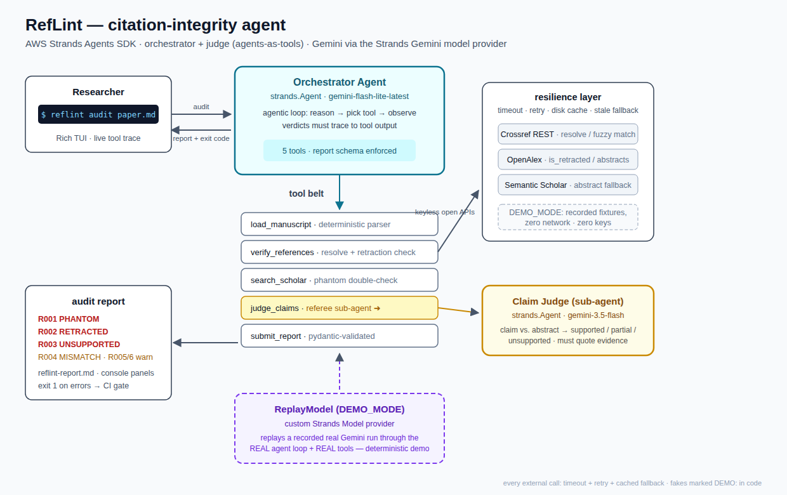
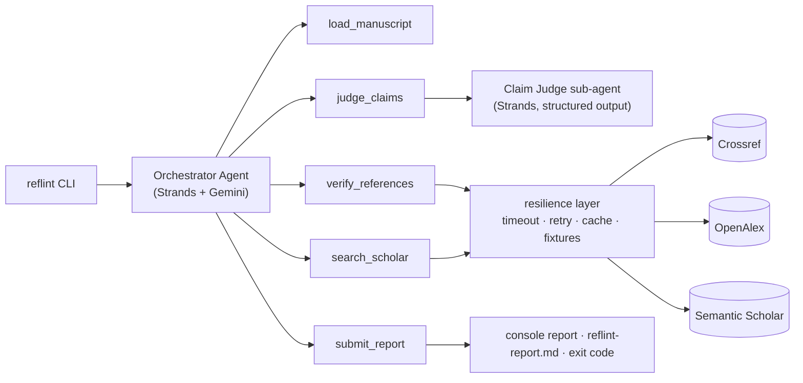

# RefLint

**A linter for your bibliography — every reference in your paper, actually
checked.** RefLint is a citation-integrity agent built on the
**AWS Strands Agents SDK**: give it a manuscript and it reads every
reference, resolves it against the open scholarly record (Crossref,
OpenAlex, Semantic Scholar), flags retracted and non-existent
(AI-hallucinated) citations, and judges — with quoted evidence — whether
each cited paper actually supports the sentence that cites it.

*Hackathon track: **Professional Agents** — reference checking is the
definition of repetitive, judgment-heavy work researchers already do.*



## Why

I'm a researcher. Before every submission I hand-check the bibliography,
and since LLM-drafted related-work sections became normal, I check twice:
phantom references that don't exist, retracted papers cited as evidence
(the retracted Surgisphere Lancet paper has been cited over 1,200 times),
and real papers cited for claims they never made. That audit takes hours
per paper. Everyone else's agent uses AI to *write* papers; RefLint uses
an agent to *catch what AI broke*.

## What it does (the golden path)

```console
$ uv run reflint audit examples/demo_paper/paper.md
```

1. **`load_manuscript`** — parses the paper into claims (cited sentences)
   and structured references.
2. **`verify_references`** — resolves every reference: DOI lookup, fuzzy
   title matching (Crossref + OpenAlex second opinion), OpenAlex
   `is_retracted` flags, abstracts (Semantic Scholar fallback for
   publisher-restricted ones).
3. **`search_scholar`** — the agent double-checks suspected phantoms with
   sharper queries before accusing anyone of hallucinating.
4. **`judge_claims`** — a second, focused Strands agent (agents-as-tools)
   compares each claim against the cited paper's abstract and returns
   structured verdicts that must quote evidence.
5. **`submit_report`** — schema-validated report: console panels +
   `reflint-report.md`, and **exit code 1 if any error-level finding** —
   so RefLint doubles as a pre-submission CI gate.

### Findings taxonomy

| Code | Meaning | Severity |
|---|---|---|
| R001 | PHANTOM — reference not found in the scholarly record | error |
| R002 | RETRACTED — cited work has been retracted | error |
| R003 | UNSUPPORTED — source does not support the claim | error |
| R004 | MISMATCH — reference metadata contradicts the record | warning |
| R005 | UNVERIFIABLE — could not be checked | warning |
| R006 | PARTIAL — source only partially supports the claim | warning |

On the bundled demo paper (`examples/demo_paper/paper.md`, six references,
three planted integrity failures) RefLint catches a retracted Lancet
paper cited as supporting evidence, a plausible-looking reference that
exists nowhere, and a real Cell paper cited for a claim its abstract never
makes.

## Quickstart

Requires Python ≥ 3.12 and [uv](https://docs.astral.sh/uv/).

```console
$ git clone https://github.com/xiehuanyi/reflint && cd reflint
$ uv sync
$ cp .env.example .env        # put your Gemini API key in GOOGLE_API_KEY
$ uv run reflint audit examples/demo_paper/paper.md
```

No key? The complete golden path also runs **fully offline**:

```console
$ DEMO_MODE=1 uv run reflint audit examples/demo_paper/paper.md
```

DEMO_MODE replays a recorded real Gemini run through the **real** Strands
agent loop and the **real** tools, against recorded API fixtures — zero
keys, zero network, deterministic. (Honesty note: in demo mode the model
responses are recorded, the tool executions are live-against-fixtures;
`fixtures/` was produced by the same command with `RECORD_FIXTURES=1`.)

## Architecture

- **Orchestrator agent** — `strands.Agent` on the Strands **Gemini model
  provider** (`gemini-flash-lite-latest`), driving five tools; the system prompt
  forbids verdicts that don't trace to tool output.
- **Claim judge** — a second `strands.Agent` (`gemini-3.5-flash`,
  deliberately a different free-tier quota bucket) wrapped behind the
  `judge_claims` tool (agents-as-tools). It sees only claim + abstract and
  must quote its evidence; all pairs are judged in one structured-output
  call.
- **Resilience layer** — every external call ships timeout + retry +
  disk cache + stale-cache fallback; a dead API degrades the verdict to
  UNVERIFIABLE instead of killing the audit. Raw Gemini 429/503s are
  mapped to Strands' `ModelThrottledException` so the SDK's
  exponential-backoff retry handles quota spikes.
- **ReplayModel** — a custom Strands `Model` provider that replays a
  recorded run for the offline demo.



## Repo map

```
src/reflint/        agent.py (orchestrator + models) · tools.py (tool belt)
                    scholar.py (API clients) · manuscript.py (parser)
                    report.py (schema + rendering) · replay.py (DEMO_MODE)
examples/demo_paper paper.md — 6 refs, 3 planted integrity failures (DEMO: seeded)
                    sample-report.md — real output of a live run on it
fixtures/           recorded run + API fixtures for DEMO_MODE
assets/             architecture diagram (SVG + PNG)
docs/               idea brief · plan · submission · video script · article
```

## AI tools used

Built during the submission period with an AI coding agent (Claude) doing
the implementation under human direction; all design decisions, the
planted-failure demo manuscript, and final review are the author's. See
`docs/ai-usage.md` for the full disclosure log.

## License

[MIT](LICENSE)
